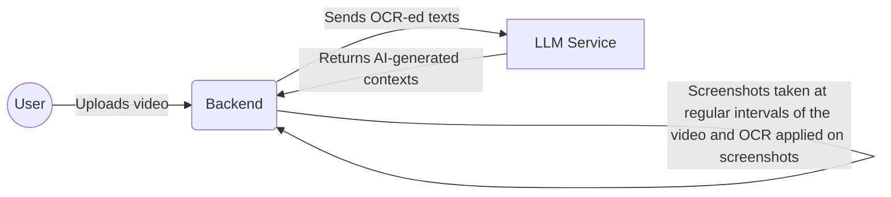
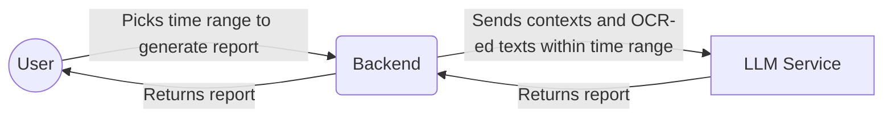

# Onelook

Onelook is an open-source, self-hosted project that generates pentesting reports based on screen recordings of pentesting sessions. It aims to help pentesters in the report generation process by

1. Avoiding context switching to jot down notes during the pentesting session.
2. Based on the exploits found, draft a detailed report which the user can review or edit upon.

<!-- TODO: insert demo video -->

## How it works

Either upload a screen recording of a pentesting session or start a screen recording directly from the webapp when conducting a pentesting session. Onelook processes the video (see [Video processing](#video-processing)) and once processing is completed, you can create reports by picking segments in the video.

If you are familiar with Microsoft's Recall feature or Rewind.ai, the concept is similar - extracting data from screen recordings - but with major differences.

| ❌ Onelook Is Not                                                                                                                          | ✅ Onelook Is                                                                                                                                                                        |
| ------------------------------------------------------------------------------------------------------------------------------------------ | ------------------------------------------------------------------------------------------------------------------------------------------------------------------------------------ |
| It is not local-first or even local (at least not yet).                                                                                    | A webapp that you have to host (on your own machine if you wish) with a backend that does the processing. This may change as we are still working on the project, but no guarantees. |
| It does not just start up and run magically, nor capture every moment of your activities behind the scenes and make everything searchable. | It is a highly-specific tool with a niche use case - help draft pentesting reports. You know it when it is running and recording your screen (because you have to start it).         |
| Onelook is not connected to an LLM out-of-the-box.                                                                                         | **You choose your own LLM-provider to connect to. It can also be your self-hosted LLM.** See [backend](./onelook-be/) for more details.                                              |

### Video processing

**No video nor images** are being sent to the LLM at any point. Onelook captures screenshots at regular intervals of the video. OCR is applied to the screenshots to extract texts. These texts are sent to the LLM to generate contexts for the video. These contexts, together with the texts extracted from OCR, are sent to LLM for report generation.

#### Video uploading

#### Report generation

## Services

Onelook has 2 services - frontend and backend. Both have to run for the app to work. Please refer to the respective folders for details:

- [Onelook Frontend](./onelook-fe/)
- [Onelook Backend](./onelook-be/)

## License

See the [LICENSE](LICENSE) file for details.

## Roadmap

These are the major features we are currently working on:

| Feature                   | Description                                                                                  | Status         |
| ------------------------- | -------------------------------------------------------------------------------------------- | -------------- |
| Improve Report Generation | Major update to the report generation step so that smaller-context LLMs will also work well. | 🚧 In progress |
| Information Scrubbing     | After OCR step, detect and scrub sensitive information before sending them to LLM.           | 🚫 Not started |

## Support

- [Github Issues](https://github.com/onelook-ai/onelook/issues): for bugs or feature requests.
- Or you can reach us at our [email](mailto:hey@onelook.ai)
